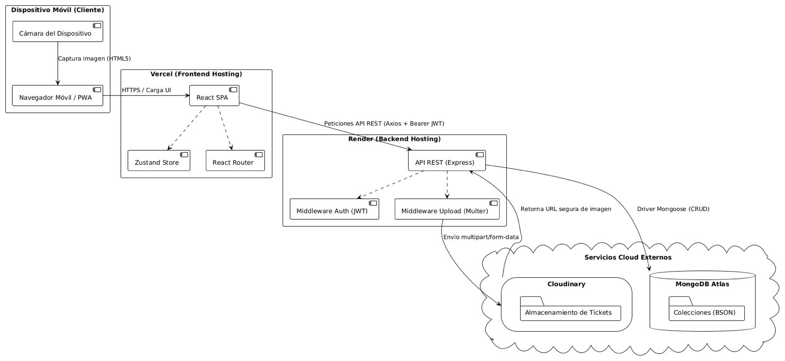

# Viabilidad Técnica · <Equipo 1>

## 1. Análisis de Requisitos Funcionales y Priorización (MoSCoW)

### Must have 

1. Registrar un nuevo usuario (autónomo/técnico) en el sistema.
2. Iniciar sesión en la aplicación móvil con credenciales seguras.
3. Crear un presupuesto añadiendo líneas de concepto rápidas (ej. “Mano de obra”, “Material”).
4. Generar un enlace público temporal para compartir un presupuesto.
5. Subir una fotografía desde la cámara del móvil de un ticket de compra.
6. Asociar la fotografía de un ticket a un presupuesto/trabajo en curso.

### Should have 

7. Aceptar o rechazar un presupuesto desde el enlace público (vista del cliente).
8. Listar el histórico de presupuestos con su estado (pendientes, aceptados, rechazados).
9. Listar los gastos acumulados a partir de los tickets fotografiados en un mes.
10. Redirigir automáticamente a la app nativa de WhatsApp con un mensaje predefinido que incluya el enlace.

### Could have 

11. Calcular el beneficio neto de un trabajo restando los tickets asociados al total presupuestado.
12. Descargar un presupuesto aceptado en formato PDF.

### Won't have

13. Integrar con cuentas bancarias para la conciliación de pagos.
14. Gestionar el inventario y stock físico de los materiales del almacén.

## 2. Producto Mínimo Viable (MVP)

El MVP se compone estrictamente de los 6 requisitos funcionales catalogados como **Must have**. Todo lo demás queda fuera de esta primera iteración.

### Recorrido mínimo del usuario:

- Acceso: Abre la aplicación móvil e inicia sesión con su cuenta.

- Creación: Tras diagnosticar una avería in situ, crea un nuevo presupuesto añadiendo líneas de gasto básicas (material y mano de obra).

- Envío: Genera un enlace público temporal de ese presupuesto y se lo envía a su cliente por WhatsApp para que lo vea al instante.

- Registro de gasto: Al salir, pasa por el almacén a comprar repuestos. Toma una fotografía del ticket físico de papel usando la cámara de la propia aplicación.

- Asociación: Asocia esa fotografía al presupuesto recién creado, dejando el gasto registrado y resolviendo su problema principal sin necesitar un ordenador.

## 3. Requisitos técnicos: frontend e infraestructura

### 3.1 Frontend (React)

La app será una web pensada para el móvil, con botones grandes y casi sin teclear. Habrá dos vistas: la del autónomo, que entra con su cuenta, y la del cliente, que solo abre el enlace del presupuesto sin registrarse. Usaremos Vite para crear y compilar el proyecto de React, y las siguientes bibliotecas adicionales:

**Navegación: React Router**
- *Para qué:* moverse entre las pantallas (login, panel, crear presupuesto, gastos) y definir la ruta pública del presupuesto (`/p/:token`), que es la que abre el cliente desde el WhatsApp.
- *Por qué:* es el estándar para hacer una aplicación de una sola página en React, y la ruta con parámetro nos permite que el enlace lleve directamente al presupuesto correcto sin que el cliente tenga que registrarse.

**Gestión del estado: Context de React + TanStack Query**
- *Para qué:* el Context guarda lo que se comparte entre pantallas (el usuario con sesión y el presupuesto que se está montando). TanStack Query guarda y actualiza los datos que vienen del servidor (lista de presupuestos, gastos) y gestiona los estados de carga y error.
- *Por qué:* nuestro estado compartido es pequeño y no justifica una biblioteca como Redux. TanStack Query nos ahorra escribir a mano la carga y los errores en cada pantalla, y ayuda cuando la cobertura en la calle es mala porque puede reintentar las peticiones.

**Componentes de interfaz: Tailwind CSS + lucide-react**
- *Para qué:* Tailwind para los estilos y el diseño adaptado a móvil. lucide-react para los iconos de los conceptos (tubería, mano de obra...), que son la base de la interfaz de "pulsar iconos".
- *Por qué:* no usamos una biblioteca de componentes prehechos (como MUI) porque nuestra interfaz es muy específica, con botones grandes y pocas pantallas, y con Tailwind tenemos más control sobre el diseño. Los iconos de lucide son ligeros y solo se carga cada icono que se usa.

**Peticiones al backend: Axios**
- *Para qué:* hacer las llamadas a la API de Express (crear presupuestos, subir tickets, iniciar sesión).
- *Por qué:* permite configurar una vez la URL del backend y enviar el token de sesión en todas las peticiones de forma automática.

**Formularios: React Hook Form**
- *Para qué:* los pocos formularios que habrá (login y registro).
- *Por qué:* simplifica la validación con poco código. Habrá pocos formularios porque nuestro objetivo es que el usuario teclee lo mínimo.

**Sin biblioteca:** la foto del ticket se hace con un `<input type="file" capture>`, que abre la cámara del móvil, y el envío por WhatsApp se hace con un enlace `wa.me`, que abre WhatsApp con el mensaje ya escrito.

### 3.2 Backend (Node.js + Express)

El servidor se encargará de exponer una API REST que será consumida por el frontend mediante Axios. La lógica de negocio cubrirá los requisitos de la siguiente manera:

*   **Autenticación y Seguridad (JWT + bcrypt):** Para el inicio de sesión del técnico, usaremos JWT (*JSON Web Tokens*). Al ser *stateless*, el servidor no guarda sesiones; el frontend almacenará el token y lo enviará en cada petición. Las contraseñas se almacenarán encriptadas mediante la librería **bcrypt**.
*   **Permisos y Roles:**
    *   **Técnico (Autenticado):** Rutas que requieren validar el JWT. Permite crear presupuestos, subir tickets y listarlos.
    *   **Cliente (Invitado):** Ruta pública que busca un presupuesto utilizando el parámetro de la URL (el `token_acceso` que lee el frontend). Solo permite lectura y actualizar el estado a "Aceptado/Rechazado".
*   **Gestión de Ficheros (Multer):** Para que el servidor pueda leer las imágenes que envía el `<input type="file">` del frontend, usaremos el *middleware* **Multer**, diseñado para procesar peticiones `multipart/form-data`.
*   **Servicios Externos (Cloudinary):** Como los servidores gratuitos eliminan los archivos al reiniciarse, el backend utilizará la API de Cloudinary para alojar las imágenes. El plan gratuito incluye 25 créditos mensuales (1 crédito = 1.000 transformaciones o 1 GB de almacenamiento), garantizando que el MVP funcione sin coste.

### 3.3 Base de Datos (MongoDB)

Utilizaremos MongoDB (mediante Mongoose) alojada en Atlas. El esquema preliminar de las colecciones principales está diseñado estrictamente para cubrir el MVP:

**1. Colección `usuarios`**
*   *Propósito:* Almacena las credenciales del profesional autónomo.
*   *Campos:* `_id`, `email`, `password_hash` (encriptada).

**2. Colección `presupuestos`**
*   *Propósito:* Almacena el documento que se envía al cliente.
*   *Campos principales:* `_id`, `fecha_creacion`, `conceptos` (Array de objetos `[{ descripcion, precio }]`), `total_presupuesto`, `estado` (Pendiente / Aceptado / Rechazado).
*   *Campos clave:* `token_acceso` (UUID aleatorio para que el cliente lo abra sin iniciar sesión) y `usuario_id` (Referencia al autor en la colección `usuarios`).

**3. Colección `tickets`**
*   *Propósito:* Archiva los justificantes de compra y los asocia a un trabajo.
*   *Campos principales:* `_id`, `fecha_subida`, `importe`, `url_imagen` (La ruta web devuelta por Cloudinary).
*   *Campos clave:* `usuario_id` (quién lo subió) y `presupuesto_id` (Referencia a `presupuestos` para asociarlo a un trabajo en curso).
  
### 3.4 Infraestructura

**¿Dónde desplegamos cada parte?**

- **Frontend: Vercel.** Despliega solo desde GitHub en cada cambio y da HTTPS gratis. Netlify también serviría, pero elegimos Vercel por su integración con GitHub y con React.
- **Backend (Node + Express): Render.** Admite Node y despliega desde GitHub. Un VPS también valdría, pero habría que administrar el servidor nosotros, y para el proyecto es más cómodo un servicio gestionado.
- **Base de datos: MongoDB Atlas.** Es MongoDB gestionado en la nube, sin tener que montar ni mantener un servidor.

**¿Necesitamos servicios cloud?** Sí, dos: Atlas para los datos y **Cloudinary** para las fotos de los tickets. Las fotos no se guardan en Render porque en su plan gratuito los archivos se pierden al reiniciar o dormirse el servicio, ni en la base de datos porque no conviene guardar imágenes pesadas en ella.

**Condiciones de los planes gratuitos**:

- **Vercel:** gratuito con el plan Hobby, pero solo para uso personal y no comercial, así que sirve para un proyecto de clase pero no para un negocio real.
- **Render:** el servidor se duerme tras 15 minutos sin tráfico y tarda cerca de un minuto en volver a arrancar. Incluye 750 horas de servicio gratuitas al mes. Render avisa de que este plan no es para producción.
- **MongoDB Atlas:** 0,5 GB de almacenamiento, máximo 500 conexiones y 100 operaciones por segundo. Pausa el clúster si pasa 30 días sin ninguna conexión.
- **Cloudinary:** 25 créditos al mes, donde 1 crédito equivale a 1.000 transformaciones, 1 GB de almacenamiento o 1 GB de ancho de banda. Es suficiente para el MVP.

**Problema del arranque de Render:** el primer acceso tras estar dormido es lento, y nuestro usuario necesita dar un precio rápido. Para evitarlo, la app hará una petición ligera al backend en cuanto el usuario la abra, así el servidor va arrancando mientras elige los iconos. Mientras tanto se mostrará una pantalla de carga clara ("Preparando tu presupuesto...") para que no parezca que la app se ha colgado. Si el proyecto pasara a producción, se contrataría el plan de pago más barato de Render, que no se duerme.

